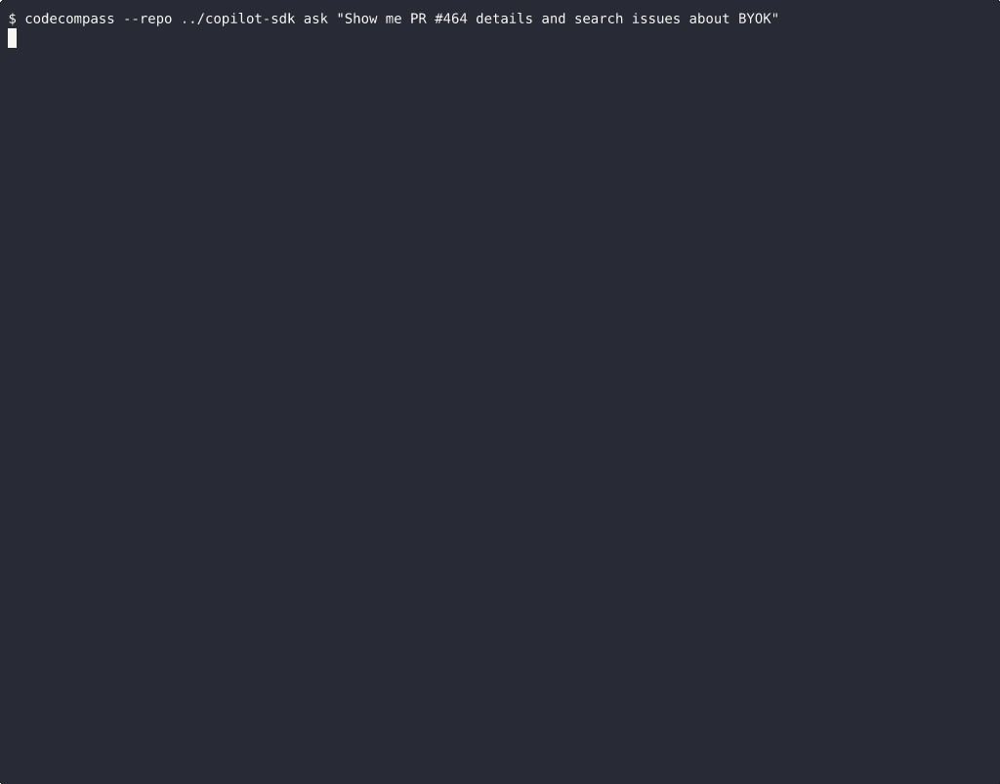
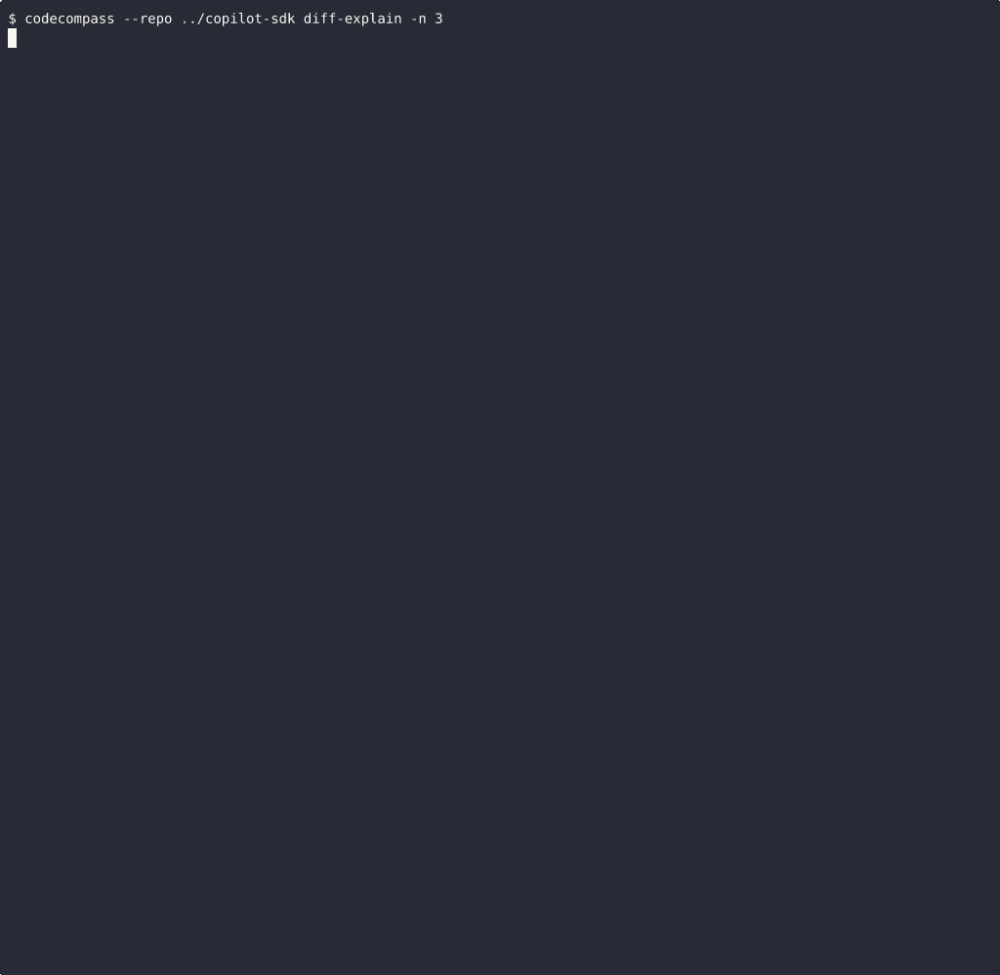

# 🧭 CodeCompass


**AI-powered codebase intelligence and onboarding assistant** — Powered by [GitHub Copilot SDK](https://github.com/github/copilot-sdk).

> *This is a submission for the [GitHub Copilot CLI Challenge](https://dev.to/challenges/github-2026-01-21)*

Point CodeCompass at any repository and get instant, structured intelligence: architecture analysis, contributor ownership, dependency graphs, documentation freshness audits, and natural-language Q&A — all grounded in a pre-built knowledge graph and real git/GitHub data.

**[See it in action →](#-demos)**

---

## Why CodeCompass?

Running `copilot` in a terminal or using Copilot Chat can answer code questions, but it starts from zero every time — reading files one by one, guessing at structure, with no access to git history, PRs, or issues.

CodeCompass is **purpose-built for repository analysis**. Before the AI answers a single question, it:

1. **Pre-indexes the codebase** — AST parsing, import tracing, symbol mapping
2. **Builds a knowledge graph** — structured data the AI queries in one call instead of ten
3. **Connects to GitHub** — PRs, issues, reviews, and commit history are available as tools
4. **Provides 12 specialized tools** — the AI doesn't guess; it queries structured data

This means answers are **faster, more accurate, and grounded in real data** — not just pattern-matched from file contents.

### CLI-First = Automatable

Because CodeCompass is a CLI tool, it fits naturally into CI/CD pipelines and automation workflows:

```bash
# Generate onboarding docs on every release
codecompass onboard --ai --output docs/onboarding.md --yes

# Audit docs for staleness in CI
codecompass audit --yes

# Export a dependency graph for the wiki
codecompass graph -o deps.md

# Summarize what changed in the last 5 commits for a Slack notification
codecompass diff-explain --commits 5 --yes
```

Every AI command supports `--yes` / `-y` to skip interactive prompts, making unattended execution straightforward.

---

## 🎬 Demos

> All demos show CodeCompass analyzing the **[GitHub Copilot SDK](https://github.com/github/copilot-sdk)** repository — a real, multi-language codebase with 303 files and 73,000+ lines.

### Rich Terminal UI

Split-pane interface: repo summary on the left, AI chat on the right. Real-time streaming responses, settings panel (Ctrl+S), and GitHub token status at a glance.


### GitHub Intelligence

Ask about PRs and issues directly — the AI fetches live data from the GitHub API.



### Diff Explain

AI-powered summaries of recent commits: what changed, why, and the impact.



### More Demos

| Demo | Description |
|------|-------------|
| [Onboarding](demos/onboard.gif) | Scan & summarize a repository |
| [Ask](demos/ask.gif) | Natural-language Q&A about code |
| [Graph](demos/graph.gif) | Generate Mermaid dependency diagrams |
| [Export](demos/export.gif) | Export onboarding docs to markdown/JSON |

---

## 🚀 Quick Start

**Linux / macOS:**
```bash
git clone https://github.com/negaga53/codecompass && cd codecompass && bash setup.sh
```

**Windows (PowerShell):**
```powershell
git clone https://github.com/negaga53/codecompass; cd codecompass; .\setup.ps1
```

The setup script checks prerequisites (Python 3.10+, Git), creates a venv, installs dependencies, and walks you through GitHub Copilot authentication.

### Manual Install

```bash
pip install -e .
```

> **Auth:** CodeCompass uses the Copilot SDK's OAuth device-flow. Run `copilot login` once — PATs are not supported by the Copilot API. Optional GitHub API features (PRs/issues) can use `GITHUB_TOKEN`.

---

## 📖 Usage

```bash
# Scan a repo and display the onboarding summary
codecompass --repo /path/to/repo onboard

# Add an AI-generated narrative
codecompass onboard --ai

# Export to a file
codecompass onboard --ai -o onboarding.md

# Ask a question (omit to be prompted interactively)
codecompass ask "How does authentication work here?"

# Ask WHY a decision was made
codecompass why "Why was Redis added?"

# AI architecture analysis
codecompass architecture

# Documentation freshness audit
codecompass audit

# Contributor ownership intelligence
codecompass contributors

# Module dependency graph (Mermaid)
codecompass graph
codecompass graph -f text -o deps.txt

# AI explanation of recent commits
codecompass diff-explain --commits 5

# Interactive multi-turn chat
codecompass chat

# Full TUI
codecompass tui

# Change model (interactive picker with premium rates)
codecompass config set-model
```

### 💎 Premium Request Awareness

Before any AI call, CodeCompass shows the selected model and its premium rate, then asks for confirmation. Free models (0x) auto-confirm. Use `--yes` / `-y` on any command to bypass.

---

## ⚙️ Configuration

```toml
# .codecompass.toml
[codecompass]
model = "gpt-4.1"
tree_depth = 4
max_file_size_kb = 512
log_level = "WARNING"
```

```bash
codecompass config init          # interactive wizard
codecompass config show          # resolved settings with source attribution
codecompass config set model X   # update a single key
codecompass config set-model     # interactive model picker
codecompass config path          # show config file location
```

Resolution order: CLI flags > env vars > repo `.codecompass.toml` > global config > defaults.

Environment variables: `CODECOMPASS_MODEL`, `CODECOMPASS_LOG_LEVEL`, `GITHUB_TOKEN`.

---

## 🏗️ Architecture

```
┌──────────────────────────────────────────────────┐
│            CodeCompass TUI (Textual)              │
│  ┌─────────────┐  ┌───────────────────────────┐  │
│  │ Repo Summary │  │  Copilot Agent Chat       │  │
│  │ Languages    │  │  (streaming responses)    │  │
│  │ Frameworks   │  │  12 custom tools          │  │
│  └─────────────┘  └───────────────────────────┘  │
│  ┌──────────────────────────────────────────────┐ │
│  │ Status: Connected (gpt-4.1) | GitHub: ✓     │ │
│  └──────────────────────────────────────────────┘ │
└──────────────────────────────────────────────────┘
        ↕ GitHub Copilot SDK (JSON-RPC)
┌──────────────────────────────────────────────────┐
│         Copilot CLI (server mode)                 │
│  ┌──────────┐ ┌───────────┐ ┌──────────────────┐ │
│  │ Built-in │ │ 12 Custom │ │ Knowledge Graph  │ │
│  │ Tools    │ │ Tools     │ │ + Git Analysis   │ │
│  └──────────┘ └───────────┘ └──────────────────┘ │
└──────────────────────────────────────────────────┘
```

### Custom Tools

| Tool | Purpose |
|------|---------|
| `search_git_history` | Search commit messages by keyword |
| `get_commit_files` | Files changed in a specific commit |
| `get_file_contributors` | Ownership data for a file |
| `read_source_file` | Read file contents (with line ranges) |
| `search_code` | Grep across the repository |
| `get_architecture_summary` | High-level structure analysis |
| `find_related_docs` | Documentation related to a source file |
| `detect_stale_docs` | Outdated documentation detection |
| `get_symbol_info` | Symbol lookup in the knowledge graph |
| `get_module_dependencies` | Module import/export relationships |
| `get_pr_details` | PR descriptions, reviews, comments |
| `search_issues` | GitHub Issues search |

---

## 📁 Project Structure

```
src/codecompass/
├── cli.py                     # Click CLI (11 commands + config group)
├── models.py                  # Pydantic data models
├── agent/                     # Copilot SDK agent orchestration + tools
├── github/                    # GitHub API client + local git ops
├── indexer/                   # Repo scanner + AST knowledge graph
├── ui/                        # Textual TUI (app + widgets)
└── utils/                     # Config management + formatting
```

---

## 🛠️ Development

```bash
pip install -e ".[dev]"
pytest
ruff check src/
```

---

## 📄 License

MIT — see [LICENSE](LICENSE).
